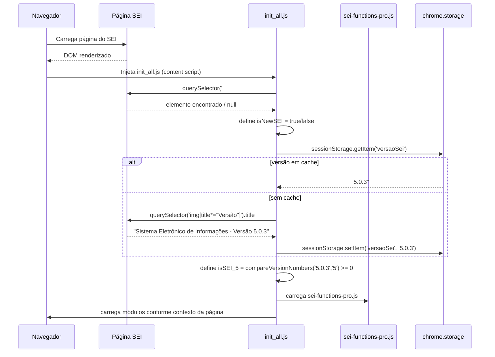
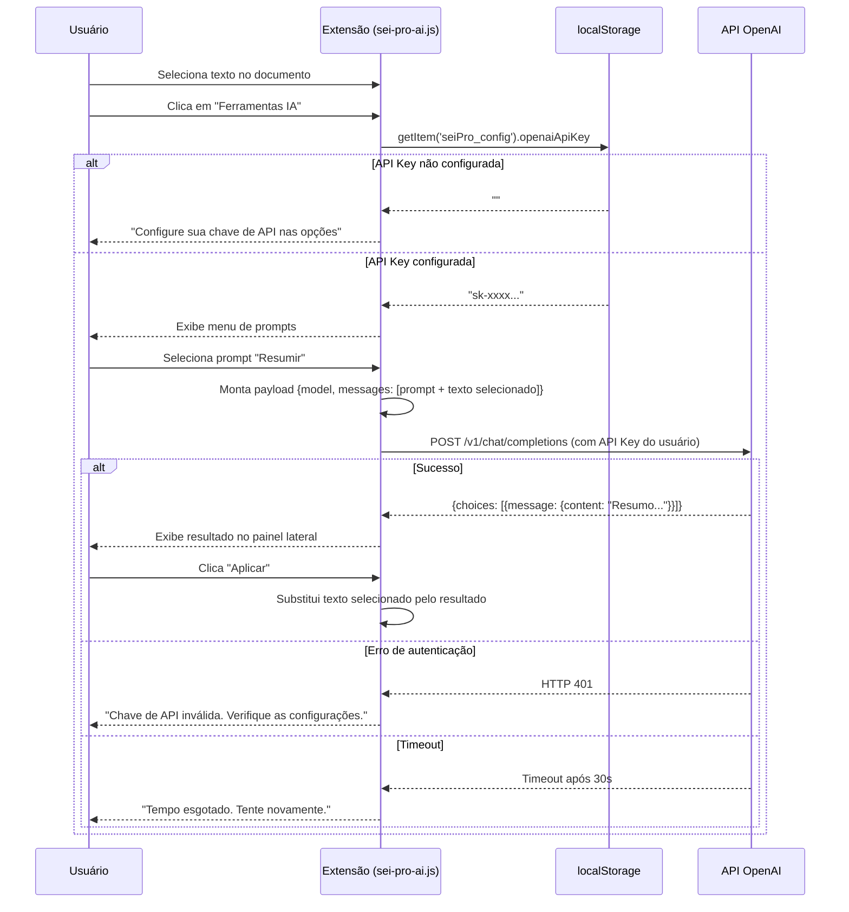
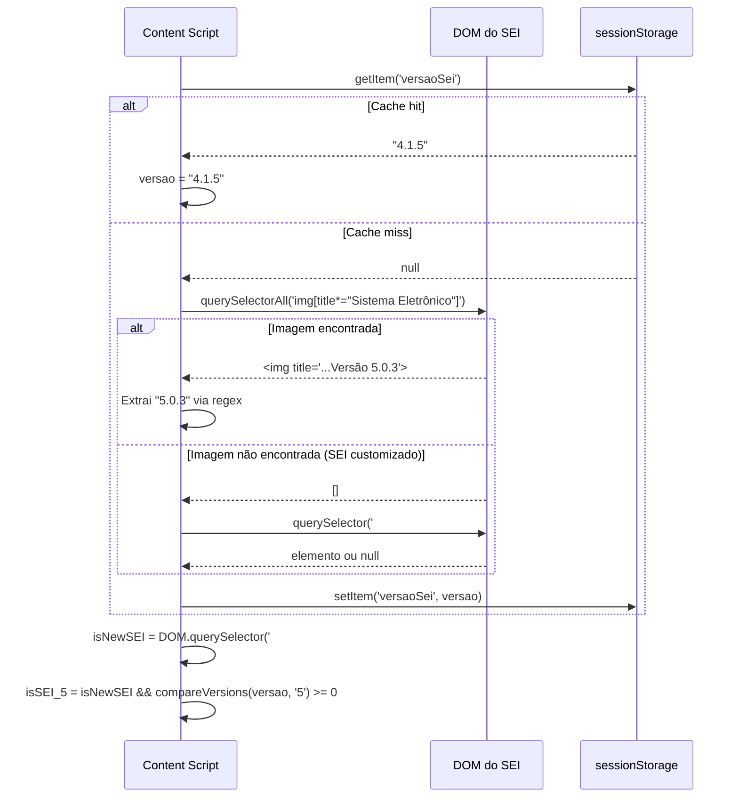
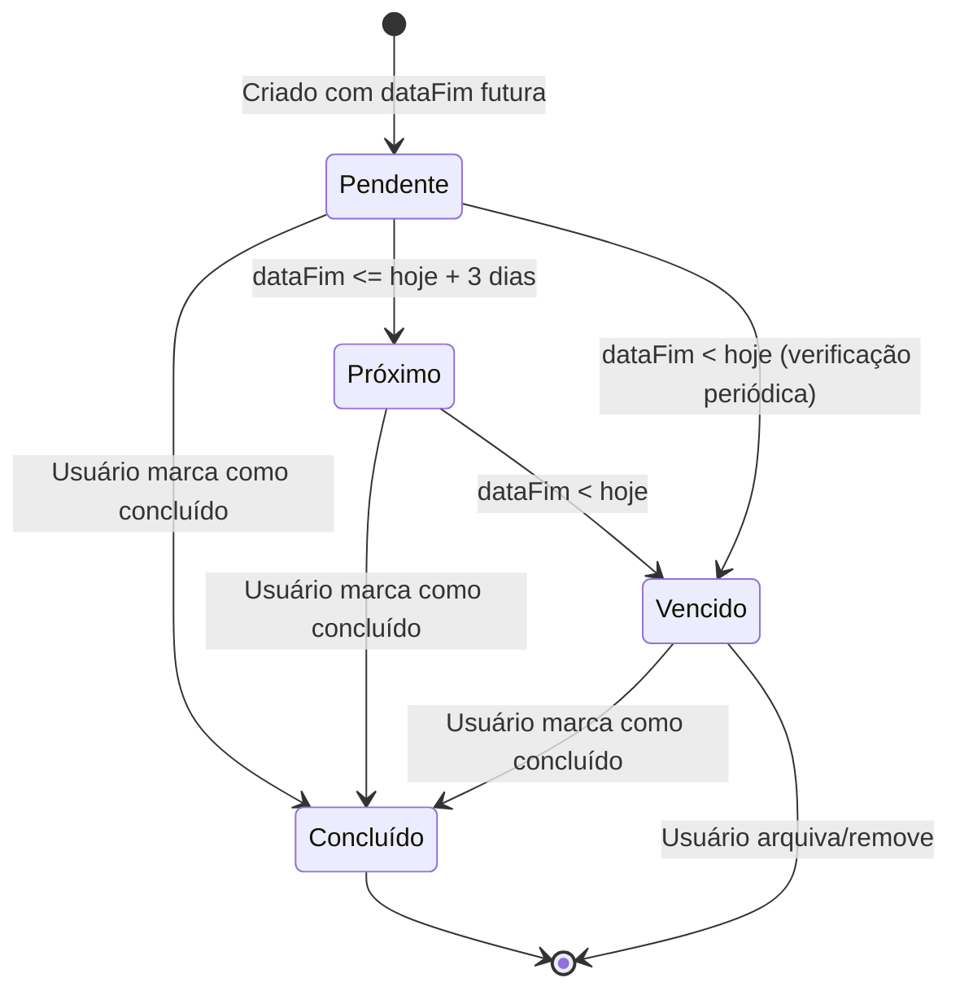

# Diagramas do Sistema

**Projeto:** SEI Pro — Fork Comunitário  
**Versão:** 1.0  
**Data:** 2025-05-13

> Diagramas em formato texto (ASCII art e Mermaid). Para renderizar os blocos Mermaid, use GitHub, VS Code com extensão Mermaid ou [mermaid.live](https://mermaid.live).

---

## 1. Diagrama de Componentes

```
┌─────────────────────────────────────────────────────────────────────┐
│                        NAVEGADOR DO USUÁRIO                         │
│                                                                     │
│  ┌──────────────────────────────────────────────────────────────┐   │
│  │                      ABA DO SEI                              │   │
│  │                                                              │   │
│  │  ┌──────────────────────────────────────────────────────┐   │   │
│  │  │              PÁGINA PRINCIPAL DO SEI                 │   │   │
│  │  │  ┌─────────────┐         ┌───────────────────────┐   │   │   │
│  │  │  │ ifrArvore   │         │  ifrVisualizacao /    │   │   │   │
│  │  │  │ (árvore de  │         │  ifrConteudoVisual.   │   │   │   │
│  │  │  │  documentos)│         │  (conteúdo/editor)    │   │   │   │
│  │  │  └──────┬──────┘         └──────────┬────────────┘   │   │   │
│  │  └─────────┼────────────────────────────┼───────────────┘   │   │
│  │            │                            │                    │   │
│  │            │ injetado por               │ injetado por       │   │
│  │            ▼                            ▼                    │   │
│  │  ┌─────────────────────────────────────────────────────┐    │   │
│  │  │                  SEI PRO (Extensão)                  │    │   │
│  │  │                                                      │    │   │
│  │  │  ┌──────────────┐  ┌─────────────┐  ┌───────────┐   │    │   │
│  │  │  │ background.js│  │ init_all.js │  │ options   │   │    │   │
│  │  │  │ (sw worker)  │  │ (global)    │  │ .html/.js │   │    │   │
│  │  │  └──────────────┘  └──────┬──────┘  └───────────┘   │    │   │
│  │  │                           │                          │    │   │
│  │  │         ┌─────────────────┼─────────────────┐        │    │   │
│  │  │         ▼                 ▼                 ▼        │    │   │
│  │  │  ┌─────────────┐  ┌─────────────┐  ┌────────────┐   │    │   │
│  │  │  │ init.js     │  │init_arvore  │  │init_visual │   │    │   │
│  │  │  │ sei-pro.js  │  │sei-pro-     │  │sei-pro-    │   │    │   │
│  │  │  │ sei-pro-    │  │arvore.js    │  │editor.js   │   │    │   │
│  │  │  │ favoritos.js│  └─────────────┘  └────────────┘   │    │   │
│  │  │  │ sei-pro-    │                                     │    │   │
│  │  │  │ atividades  │  sei-functions-pro.js (shared)      │    │   │
│  │  │  └─────────────┘                                     │    │   │
│  │  └─────────────────────────────────────────────────────┘    │   │
│  └──────────────────────────────────────────────────────────────┘   │
│                                                                     │
│  ┌──────────────────────┐    ┌──────────────────────────────────┐   │
│  │   chrome.storage     │    │  localStorage / sessionStorage   │   │
│  │   (configurações)    │    │  (favoritos, prazos, histórico)  │   │
│  └──────────────────────┘    └──────────────────────────────────┘   │
└─────────────────────────────────────────────────────────────────────┘
              │                                │
              ▼                                ▼
    ┌──────────────────┐            ┌───────────────────┐
    │   API OpenAI     │            │  Google Sheets API │
    │  (IA opcional)   │            │  (Projetos opcion.)│
    └──────────────────┘            └───────────────────┘
```

---

## 2. Diagrama de Sequência — Inicialização da Extensão



---

## 3. Diagrama de Sequência — Uso do Módulo de IA



---

## 4. Diagrama de Sequência — Detecção de Versão do SEI



---

## 5. Diagrama de Estados — Prazo



---

## 6. Fluxo de Dados — Módulo de Favoritos

```
ENTRADA (DOM do SEI)          PROCESSAMENTO               SAÍDA (DOM modificado)
──────────────────────        ──────────────────────       ──────────────────────
Tabela de processos     ──►  Lê números de processo  ──►  Ícone ★ ao lado
renderizada pelo SEI         Consulta localStorage         de cada processo
                             Marca processos já fav.
                                                     ──►  Seção "Favoritos"
localStorage             ──►  Carrega lista de        ──►  no topo da lista
(seiPro_favoritos)            Favorito[]
                              Ordena por 'ordem'
                                                     ──►  Atualiza badge
Evento: clique em ★      ──►  Cria/remove Favorito        no ícone (count)
                              Persiste no localStorage
```

---

## 7. Diagrama de Implantação

```
┌──────────────────────────────────────────────────────────┐
│                  AMBIENTE DO USUÁRIO                     │
│                                                          │
│  ┌────────────────────────────────────────────────────┐  │
│  │              NAVEGADOR (Chrome/Edge/Firefox)        │  │
│  │                                                    │  │
│  │  ┌─────────────────┐    ┌────────────────────────┐ │  │
│  │  │   SEI Pro       │    │  Perfil do Navegador   │ │  │
│  │  │   (dist/)       │    │  chrome.storage.local  │ │  │
│  │  │                 │    │  localStorage          │ │  │
│  │  │  manifest.json  │    │  sessionStorage        │ │  │
│  │  │  background.js  │    └────────────────────────┘ │  │
│  │  │  js/*.js        │                               │  │
│  │  │  css/*.css      │                               │  │
│  │  │  html/options   │                               │  │
│  │  └─────────────────┘                               │  │
│  │                                                    │  │
│  │  ┌─────────────────────────────────────────────┐   │  │
│  │  │         ABA: instancia.sei.gov.br/sei/      │   │  │
│  │  │                                             │   │  │
│  │  │   Servidor SEI (PHP) ──► HTML renderizado   │   │  │
│  │  │                  ▲                          │   │  │
│  │  │                  │ content scripts injetados│   │  │
│  │  │                  └── pela extensão          │   │  │
│  │  └─────────────────────────────────────────────┘   │  │
│  └────────────────────────────────────────────────────┘  │
└──────────────────────────────────────────────────────────┘
          │ HTTPS (opcional, sob demanda do usuário)
          ├──────────────► api.openai.com
          └──────────────► sheets.googleapis.com
```

---

## 8. Mapa de Dependências entre Módulos

```
init_all.js
    └──► sei-pro-all.js
              └──► sei-functions-pro.js (base compartilhada)

init.js
    ├──► sei-pro.js
    │        └──► sei-functions-pro.js
    ├──► sei-pro-favoritos.js
    │        └──► sei-functions-pro.js
    ├──► sei-pro-atividades.js   (controle de prazos)
    │        └──► sei-functions-pro.js
    ├──► sei-pro-ai.js
    │        └──► sei-functions-pro.js
    └──► sei-pro-docs-lote.js
             └──► sei-functions-pro.js

init_arvore.js
    └──► sei-pro-arvore.js
             └──► sei-functions-pro.js

init_visualizacao.js / init_visualizacao_html.js
    └──► sei-pro-editor.js
             └──► sei-functions-pro.js

sei-functions-pro.js  ◄── núcleo: todas as funções utilitárias e detecção de versão
    └──► lib/ (jQuery, DOMPurify, Moment.js, etc.)
```
